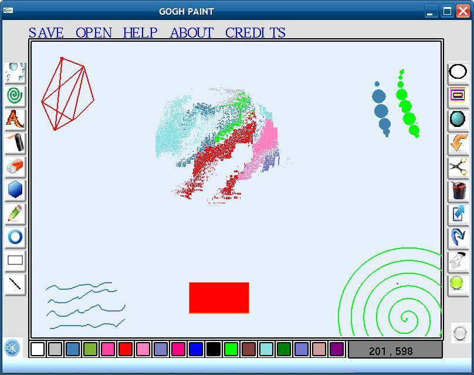

GOGH-Paint (http://en.wikipedia.org/wiki/Vincent_van_Gogh)
==========================================================

A simple graphics editor based on OpenGL 1.1. This was part of my undergraduate Graphics course. 
It is very crude, but it was a lot of fun doing it!  

Please note: The .bmp files needed by the editor have not been pushed since they are quite huge(using 640x480 images for icons was a stupid idea, 
but i used them anyway :D. Please contact me in case you would like to have the .bmp images)

Features:

1) 2D editing  
2) Template files  
3) Storing and retrieving images in .bmp format  
4) Basic 3D viewing  

